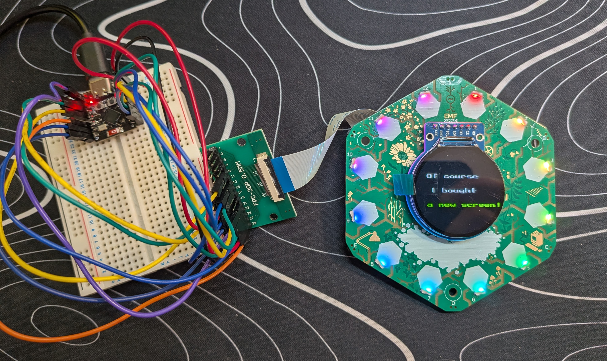

## **Tildagon Afterlife Board**

Bring your old EMF 2024 Tildagon front board back to life.

The **Tildagon Afterlife Board** is a minimal driver board for the original EMF 2024 Tildagon front PCB. It connects to the badge using the existing 30-pin FFC connector and is driven by an **ESP32-C3 SuperMini module**, turning the retired front board into a standalone development platform.

When the **Spaceagon** upgrade arrived in 2026, the original front board was replaced with new hardware. It felt like too nice a piece of engineering to end up in a drawer or a bin, so this project was born.

The goal is simple: provide an inexpensive board that lets the original hardware live on. Flash WLED if you just want pretty lights, write your own firmware in MicroPython, Arduino, ESP-IDF, or anything else you fancy, or use it as the basis for your own experiments.

## Features
- Drives all 18 addressable RGB LEDs
  - 12 LEDs on the front
  - 6 LEDs on the rear
- Supports all 6 corner buttons
- Breaks out the LCD connector
  - The original display moved to the 2026 badge, but replacement displays are inexpensive and can be fitted later.
- Preserves the original EEPROM
  - The EEPROM is intentionally not connected. There weren't enough spare GPIOs on the ESP32-C3, I couldn't think of a compelling use case, and leaving it untouched means the original badge contents remain intact should you ever want to rebuild it.

## Required Parts
To build one you'll need:
- ESP32-C3 SuperMini
- JUSHUO AFC01-S30FCC-00 30-pin FFC connector (or equivalent)
- 30-pin, 0.5 mm pitch FFC cable, same-side (Type A)

The connector spacing works out to around 40 mm, although the shortest cable I was able to source was 50 mm, which works perfectly well.

Totally optionally, you can buy a new screen. Search for GC9A01 1.28" round LCD modules.

## Project Status
**Current status: Live! You can buy this!**
Check out [my Ko-fi shop](https://ko-fi.com/s/6f3e26f617) to get both bare and pre-assembled PCBs

You can follow the project's progress on Mastodon:
https://mastodon.social/@GlitchEngine

## Planned Software
Demo scripts are on the way to show how to use each of the board's features. Don't expect a polished software ecosystem, but I'll publish anything useful I write along the way. If you build something cool, I'd love to hear about it.

## License
Firmware and documentation are licensed under the MIT Licence. Hardware design files are licensed under CERN-OHL-P v2.
Tildagon is a project by the EMF Camp team. This project is an independent community accessory and is not affiliated with or endorsed by EMF Camp.
