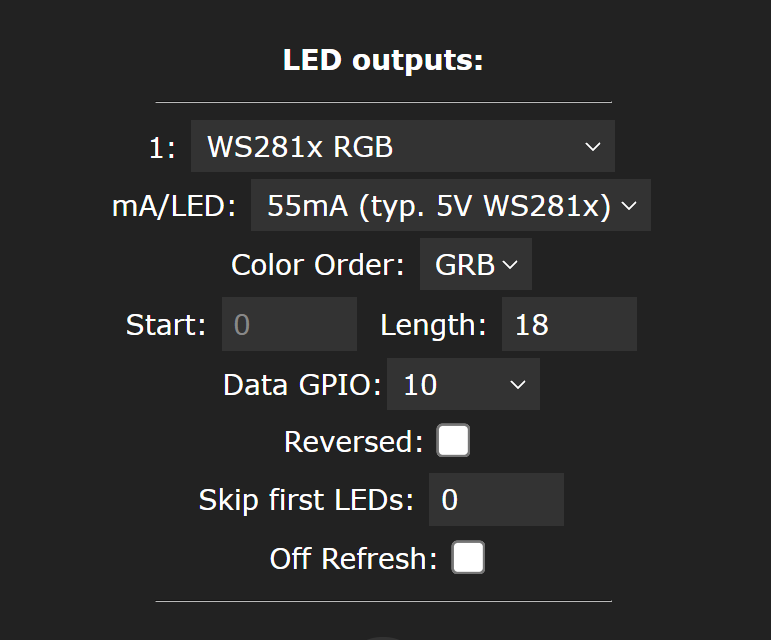
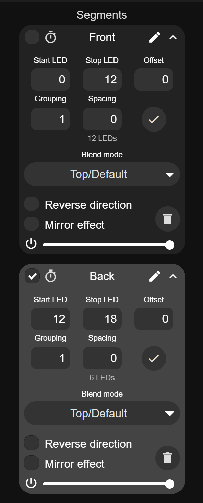
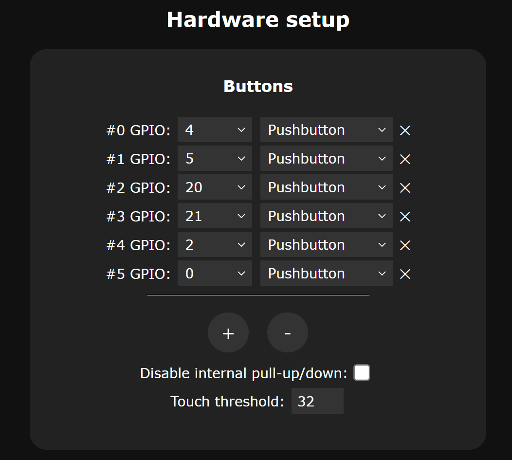
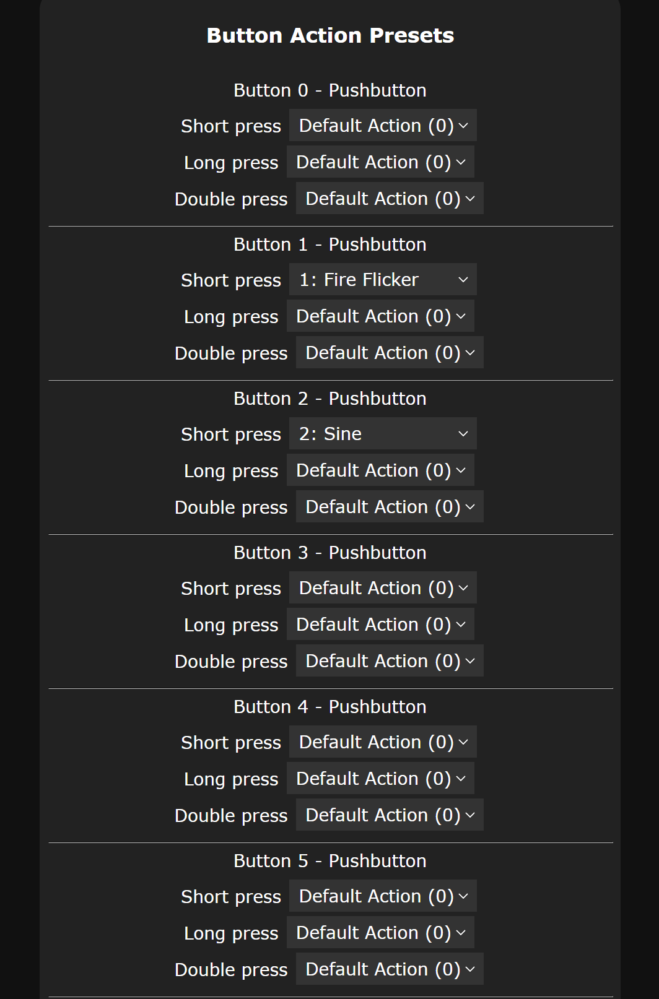
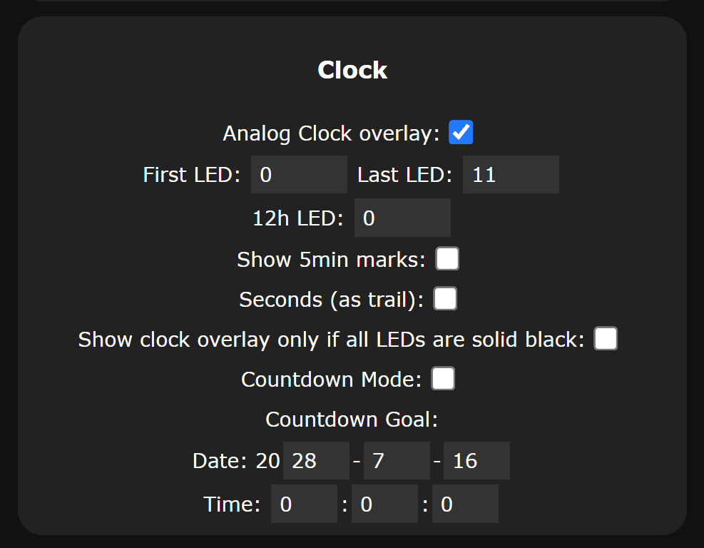

# Getting Started with WLED on Tildagon Afterlife

Looking for some oven-ready software to make flashy lights happen on Tildagon Afterlife? WLED is a great beginner-friendly option that is super quick to set up.

## What is WLED?

[WLED](https://kno.wled.ge/) is open-source ESP32 firmware that controls addressable LEDs (like WS2812/NeoPixel) over Wi-Fi. It has over 100 snazzy effects built in and is packed with neat features including nightlight auto dimming, presets and a clock mode. Effects can be controlled through a web interface, from an app or even via MQTT or Home Assistant.

## Install WLED via the web installer

1. Connect the ESP32-C3 SuperMini board to your computer using a data-capable USB-C cable.
2. Open [install.wled.me](https://install.wled.me) in a Chromium-based browser.
3. Choose the correct serial port for your device. If you don't see it in the list you might need to hold down the BOOT button whilst tapping RESET to make it show up.
4. Select the latest WLED build and flash it.
5. Enter your Wi-Fi SSID and password to connect WLED to your Wi-Fi network.
6. Click `Visit Device` to open the web interface.

If WLED cannot connect to your Wi-Fi network, it starts a Wi-Fi access point that you can join from your phone.

## Install the phone app (optional)

If you'd rather control WLED through the app, you can install it via your phone's app store. It should automatically detect a fresh WLED instance, as long as both devices are connected to the same Wi-Fi network.

- [View on Apple App Store](https://apps.apple.com/gb/app/wled-official-app/id6446207239)
- [View on Google Play Store](https://play.google.com/store/apps/details?id=ca.cgagnier.wlednativeandroid)

## First-time LED setup

After first boot, you'll need to let WLED know what pin the LEDs are connected to and how many we have. Head to `Config -> LED & Hardware` and set length to `18` and Data GPIO to `10`.

## Effects and presets

1. Choose an effect/colour you like in the main UI (note that most effects will need you to select both an effect and a colour).
2. Once you've tuned your effect to your satisfaction, save it as a preset using the `+ Preset` button so you can use it again later.

## Segments

If you set up the front and back LEDs as separate segments, you can run different effects or colours on the front and back. Click `+ Add segment` on the web UI (or the segments button at the bottom of the app) to get started.

- Segment 0 (Front): LEDs 0-12
- Segment 1 (Back): LEDs 12-18

## Buttons

The Tildagon front plate is blessed with six buttons. To use them with WLED, head to `Config -> LED & Hardware -> Hardware Setup`.

Under `Buttons` add the Tildagon button GPIOs as `pushbutton`:

- Button 0/A (GPIO4)
- Button 1/B (GPIO5)
- Button 2/C (GPIO20)
- Button 3/D (GPIO21)
- Button 4/E (GPIO2)
- Button 5/F (GPIO0)

GPIO0 (F) is assigned as Button 0 by default, so you may need to unassign it, reboot WLED, and then add it back in the right place to get all the buttons mapped correctly. The `Reboot` option lives under the `Info` tab.

In `Config -> Time & Macros -> Button Action Presets`, you can assign short, long and double button pushes to your presets to recall your saved effects. `Default Action (0)` toggles the LEDs on and off, so you probably want to leave at least one button assigned to that.

Note that GPIO2 (E) and GPIO0 (F) are boot-related pins on ESP32-C3. Avoid holding those buttons while powering up or resetting.

## Clock mode

A neat thing you can do with this board is to use the 12 front LEDs as a clock face. In `Config -> Time & Macros`:

1. Enable NTP time sync and set your timezone correctly.

2. Enable Analog Clock Overlay

3. Select LEDs 0-11.

Clock mode is an overlay, so will work on top of other effects (or you can select 'Show clock overlay only if all LEDs are solid black'). There's also a countdown mode if you want to countdown until EMF 2028 :)

Note that you will need to apply a slight physical offset to the board to make the clock LEDs line up with a standard clock face!
